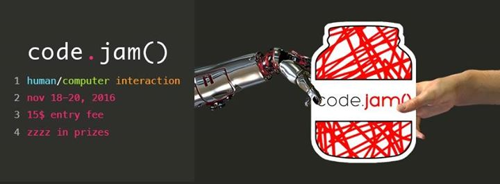

# CodeJam2016

## TV Show Recommendation Generator
This project was created by Eddy n' Charles during CodeJam 2016 to give TV show recommendations to a user. We used The [Movie DB API](The Movie DB
https://www.themoviedb.org/documentation/api) to query for TV show information and wrote everything in mostly HTML/CSS/JavaScript with some minimal JavaScript libraries but no web JavaScript frameworks.

## Dependencies
* RequireJS 2.3.2
* jQuery 1.12.4

## Design Process Description
First, we asked ourselves how to characterize a user's preferences without asking too many questions.
This led us to ask the user for some ratings in the beginning and then through the specific features
of these movies, undergo a complex mathematical process to churn out recommendations. We also wanted
the design to be simple and intuitive, which led us to use 5-star rating as a rating measure.

## Demo
All you have to do is open "index.html" in your Google Chrome browser!
Or alternatively, it is hosted on http://codejam2016.eddylu.com/ as well!

## Contribute

We are always looking for enthusiastic developers to join our startup.
Contact us at careers@TVRecDisrupt.com with a message on why you want to work with us!
